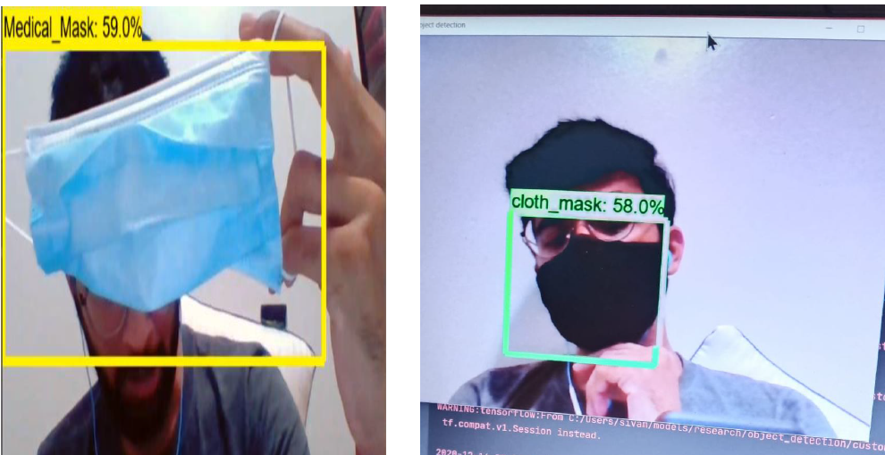

# AI Object Detection System (Face Mask & Threat Classification)


A real-time computer vision system engineered using the TensorFlow Object Detection API to classify face mask compliance and security threats. This prototype optimizes the inference pipeline for live video feeds, mimicking high-throughput physical deployment environments.

## 🚀 Key Achievements
* **97% Classification Accuracy:** Achieved robust model performance across diverse evaluation image datasets.
* **Streamlined Inference Pipeline:** Optimized live video stream processing to minimize latency for real-time security environments.
* **Enhanced Generalization:** Curated datasets and implemented advanced data augmentation to improve model resilience against edge cases, lighting variations, and environmental noise.

---

## 🛠️ Tech Stack & Frameworks
* **Language:** Python 3.7
* **Framework:** TensorFlow API (v1.14)
* **Inference Optimization:** NVIDIA TensorRT (FP16 & INT8 Precision)
* **Libraries:** OpenCV (Webcam feed processing), labelImg (Annotation), Pycocotools

---

## ⚙️ Architecture & Pipeline Optimization
The system leverages a pre-trained **Single Shot Detection (SSD) network with an Inception V2 backbone**, highly optimized for real-time edge processing on NVIDIA GPUs.

1. **Dataset Engineering:** Annotations were custom-curated using `labelImg` to build a dataset of ~450 targeted images differentiating between medical masks, cloth masks, and security anomalies.
2. **Precision Quantization:** Applied TensorRT optimization routines to calibrate and convert the frozen graph into INT8 and FP16 precision. This execution strategy maximizes Tensor Core utilization, providing low-latency inference with negligible accuracy drop.
3. **Inference Execution:** Streamlined bounding box regression overlay using OpenCV to continuously intercept frames from a live webcam feed and render predictions dynamically.

---

## 📂 Repository Structure
```text
├── object_detection/          # Core model architectures and configuration files
├── lstm_object_detection/     # Sequence-based tracking and detection logic
├── setup.py                   # Package dependencies and installation setup
└── README.md                  # Project documentation
